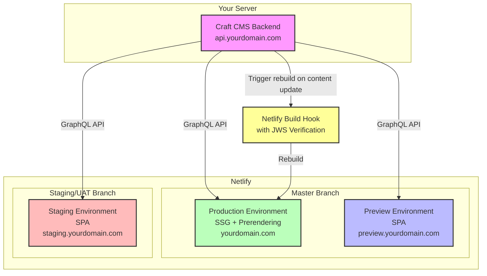

# Craft CMS + Nuxt Starter Hosting on Netlify with SSG and Prerendering

This project is forked from the [Craft CMS + Nuxt Starter](https://github.com/craftcms/starter-nuxt) and modified to be hosted on Netlify with static site generation (SSG) and prerendering.

This project expects you to deploy your site like this:

1. Craft CMS backend hosted on a server of your choice
2. Nuxt frontend hosted on Netlify, with three build environments: `staging`, `preview`, and `production`

   - `ENV=production`: Uses SSG and prerendering to cache all page content statically on Netlify. Deploy with `master` branch.
   - `ENV=preview`: Uses Nuxt as a front-end SPA, reacts instantly to your changes in the Craft CMS backend. Used for the live preview feature. Deploy with `master` branch.
   - `ENV=staging`: Uses Nuxt as a front-end SPA, reacts instantly to your changes in the Craft CMS backend. Used as staging environment for development purposes. Should deploy with `staging` or `uat` branch.

To get started, clone this repository and following steps over at: https://github.com/craftcms/starter-nuxt?tab=readme-ov-file#quick-start

After you get everything done, move to here to deploy your site on Netlify.

## Deployment

### Architecture Overview



### Setup Steps

1. Update the `/frontend/queries/build.mjs` file to ensure it selects all Craft CMS entries' URIs you want to prerender.
2. Update the `netlify.toml` file with your site's address.

   - Replace `https://api.nuxt-starter.yourdomain.com` with your Craft CMS backend address.
   - Replace `https://nuxt-starter.netlify.app` with your SSG production address.
   - Replace `https://nuxt-starter-preview.netlify.app` with your SPA preview address.
   - Replace `https://nuxt-starter-staging.netlify.app` with your SPA staging address.

3. You can put the entire project, backend and frontend into a single repository or separate them into two repositories. If you separate them, you will need to update the `netlify.toml` file with the correct build command and publish directory.

   If you use a single repository, you can use the following `netlify.toml` file:

   ```toml
   [build]
      base = "/frontend"
      command = "npm install && npm run generate"
      publish = "dist"
   ```

   Otherwise, you should set the `base` to the root directory and update the `command` and `publish` directory accordingly:

   ```toml
   [build]
      base = "/"
      command = "npm install && npm run generate"
      publish = "dist"
   ```

4. You can also add a Netlify build hook to your Craft CMS backend to trigger a rebuild of the frontend when you publish new content.

   - Go to your Netlify site settings > Build & Deploy > Build hooks
   - Create a new build hook and copy the URL
   - Update your `./backend/.env` file to add the NETLIFY_BUILD_HOOK_URL and NETLIFY_BUILD_HOOK_JWS_SECRET values (see `./backend/.env.example` for reference)
   - The webhook functionality is already implemented in the Craft CMS module

## Why we are not using SSR

SSR requires extra server resources and is not necessary for most websites. SSG and prerendering are more than enough for most use cases. With GraphQL, you can limit the data you need to fetch and efficiently cache it on the client side.
